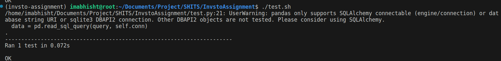
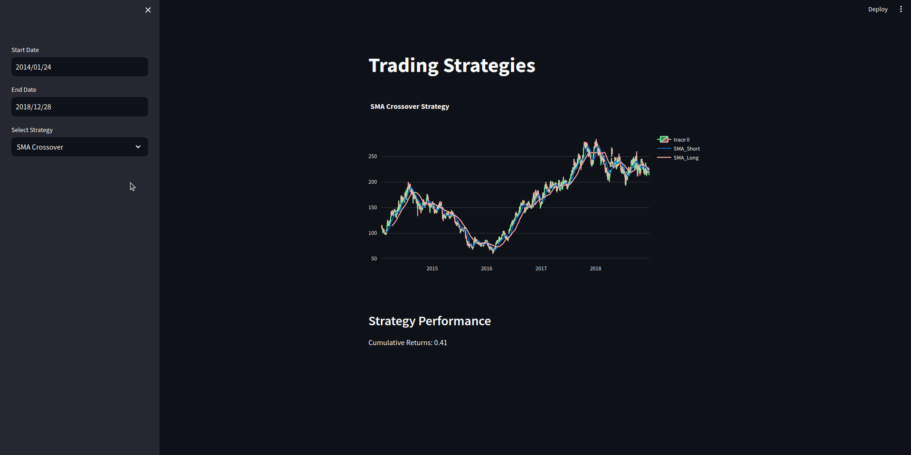
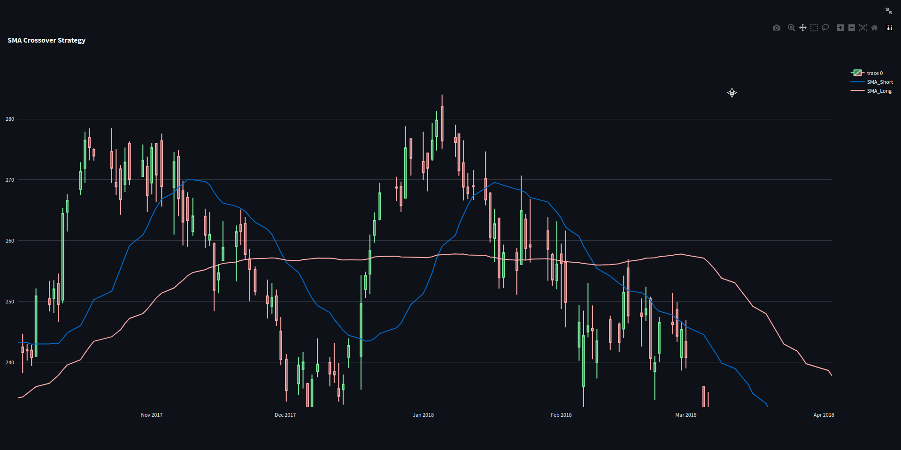
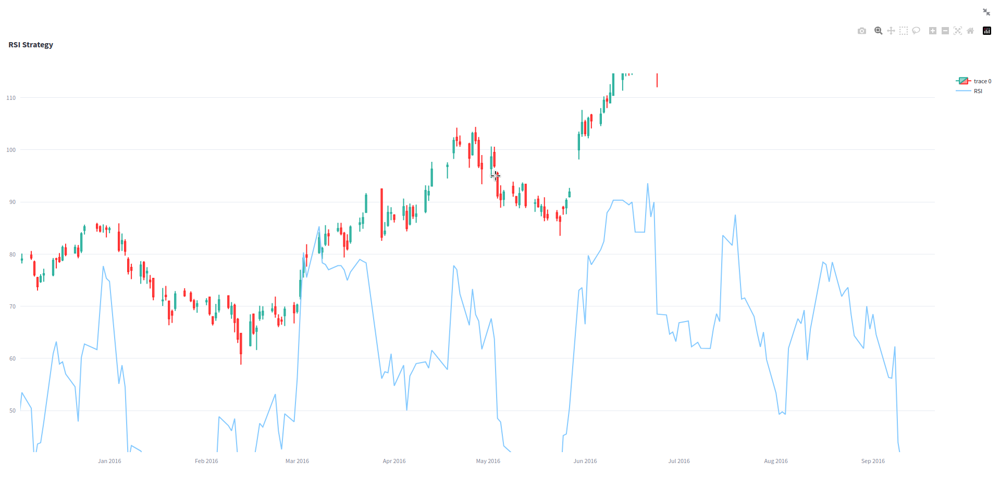
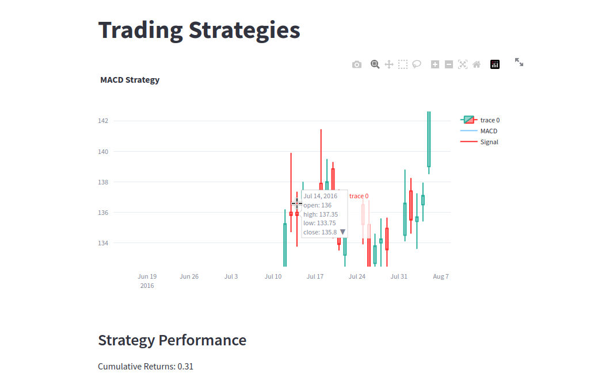

# Invsto - Stock Analysis and Strategy

This is a Streamlit App that run analysis and investing/trading strategy on stock data. Stock data is added from xlsx file and the app will run analysis and strategy on the data. The app will also display the data in a table and a chart.

## Demo

Check Demo Video of the App: [Watch the video](./screenshots/invsto_submission-2024-03-09_12.32.31.mp4)

## Features

- Add Stock Data from xlsx file
- Run Analysis on the Stock Data
- Run Investing/Trading Strategy on the Stock Data
    - Moving Average Crossover Strategy
    - RSI Strategy
    - MACD Strategy

- Display the Stock Data in a Table
- Display the Stock Data in a Chart
- Unit Testing on the Data

## Table of Contents

- [Installation](#installation)
- [Usage](#usage)
- [Screenshots](#screenshots)
- [Features](#features)

## Installation

You need to have Docker Installed on your machine. If you don't have Docker installed, you can download it from [here](https://www.docker.com/products/docker-desktop).

The Program is tested on Linux. To run the Program on Windows, change the python command in the `./start.sh` & `./test.sh` to `python` instead of `python3`.

## Usage

To run the Program, just run the `./start.sh` script. The script will build the Docker Image and run the Docker Container. The app will be available at `http://localhost:8501`.

To run the tests, just run the `./test.sh` script. The script will run the tests in the Docker Container.

## Screenshots

Unit Testing on Data:

